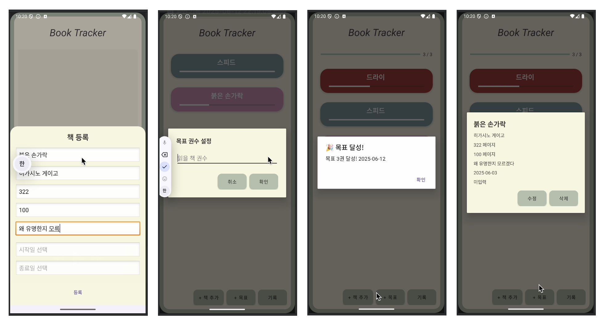
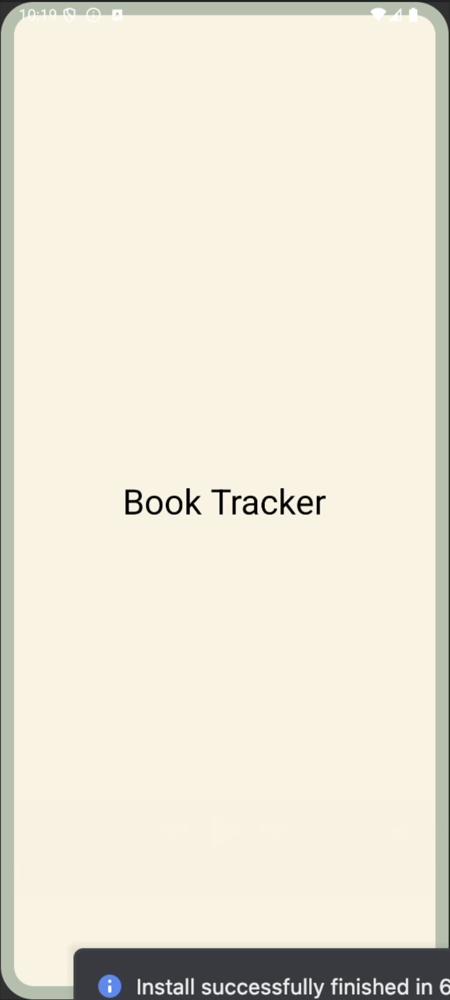

## My Book Tracker - 2025-1 안드로이드 스튜디오 기말 프로젝트

> 이 앱은 기존 독서 기록 앱을 기반으로,  
> 필요하지 않은 기능을 제외하고 개인의 필요에 맞게 재구성하였으며,  
> 학습 범위 확장을 위해 새롭운 기능을 추가했습니다.

---
### 개요
책을 관리하고 기록하는 앱
- 읽고 싶은 책이나 읽은 책을 등록하고, 총 페이지 수와 현재 페이지 수를 통해 책의 진행 상황을 확인할 수 있다.
- 책의 제목, 저자, 시작일, 종료일, 메모 등 상세 정보를 입력하고 수정하면서 독서 활동을 기록할 수 있다.

---
### 개발 환경
- **언어**: Kotlin
- **IDE**: Android Studio
- **Kotlin JVM Target**: 11
- **Gradle 버전**: 8.11.1
- **SDK 버전**: 35

> **booktracker-ds-team**과의 차이점
>   1. 목표를 직접 설정
>   2. 각 책의 현재 진도율 표시

---
### 주요 기능
- 책 등록과 현재 진도율 표시
- 원하는 목표 설정 및 진도바 표시
- 목표 달성 여부 기록 확인

  

---
### 프로젝트 구조

📂 클릭해서 보기

.
├── AndroidManifest.xml
├── java
│   └── com
│       └── example
│           └── mybooktracker
│               ├── model
│               │   ├── Book.kt
│               │   └── GoalRecord.kt
│               └── ui
│                   ├── AddBookBottomSheet.kt
│                   ├── BookAdapter.kt
│                   ├── BookDetailDialog.kt
│                   ├── GoalRecordDialog.kt
│                   ├── MainActivity.kt
│                   └── SplashActivity.kt
└── res
    ├── drawable
    │   ├── background_app_container.xml
    │   ├── ic_launcher_background.xml
    │   ├── ic_launcher_foreground.xml
    │   ├── rounded_add_book_background.xml
    │   ├── rounded_button.xml
    │   ├── rounded_dialog_background.xml
    │   └── rounded_top_only.xml
    ├── layout
    │   ├── activity_main.xml
    │   ├── activity_splash.xml
    │   ├── dialog_book_detail.xml
    │   ├── dialog_goal_record.xml
    │   ├── dialog_set_goal.xml
    │   ├── fragment_add_book.xml
    │   └── item_book.xml
    ├── values
    │   ├── colors.xml
    │   ├── strings.xml
    │   ├── styles.xml
    │   └── themes.xml
    ├── values-night
    │   └── themes.xml
    └── xml
        ├── backup_rules.xml
        └── data_extraction_rules.xml

---
### 시연 영상
[youtube 링크](https://youtu.be/hJgjR95GOdQ)

    

